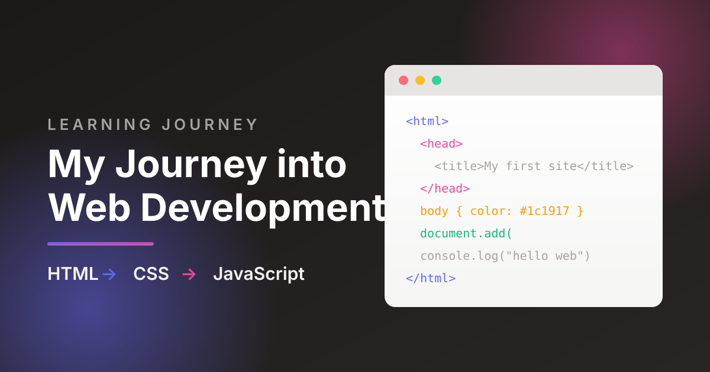
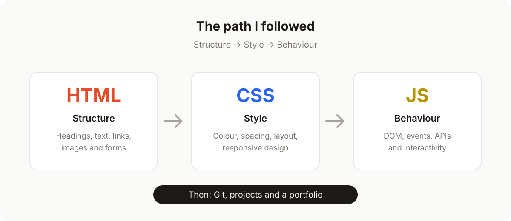

The first website I ever built was a single white page with a blue heading and my name typed in the middle. I opened it in a browser, pressed refresh about forty times, and still could not believe that the code I wrote in a plain text file was actually rendering on a screen. That small, slightly ugly page is where my programming learning started — and it eventually led me to a career in full-stack web development.

This post is the honest version of that journey: what I read, what I practised, where I got stuck, and what I would do differently today. Whether you are a beginner deciding how to learn to code, a career switcher weighing a move into tech, or a hiring manager trying to understand what a real development background looks like, this learning journey should give you a useful map.

## Why I Started My Programming Learning With a Book

When I decided to learn web development, I did exactly what most people do: I opened twenty browser tabs, watched four unfinished video courses, and saved a folder full of bookmarks I never reopened. Progress was slow because nothing was sequenced.

So I changed tactics. I bought a single physical resource — [Complete Web Design and Development, available on Rokomari](https://www.rokomari.com/book/65799/complete-web-design-and-development) — and I gave myself one rule: finish the book, chapter by chapter, before collecting anything new.

### The book that made the difference

That book provided a comprehensive guide to the fundamentals of web development. It started with markup, moved into styling, introduced programming logic, and finished with the pieces needed to publish a real site. Because everything lived in one place, I stopped hopping between tutorials and started building a mental model of how the web actually works.

### Why one structured resource beats a hundred bookmarks

A book forces sequencing. You cannot style a page you have not structured, and you cannot add behaviour to a page you cannot style. That order — HTML, then CSS, then JavaScript — is not an arbitrary teaching trick. It mirrors how browsers actually interpret a document, and following it meant every new lesson stacked on something I already understood.

> The fastest way to slow down your learning is to keep starting over with a new resource.

## Stage 1: HTML and the Moment It Clicked

HTML felt unfamiliar for about two days. After that, it clicked, because HTML is really just structured writing. Headings, paragraphs, lists, links, images, forms — every element is a label that tells the browser what a piece of content *means*.

```html
<article>
  <h1>My first web page</h1>
  <p>I built this while learning HTML.</p>
  <a href="/about.html">About me</a>
</article>
```

That semantic mindset changed how I read every website I visited. Instead of seeing a finished design, I started seeing outlines: navigation here, an article there, a footer at the bottom. Within a couple of weeks I had rebuilt the structure of three sites I admired as clean, semantic HTML — no styling, just honest markup.

If you are starting in web development, spend your first two weeks here and resist the urge to jump ahead. Solid HTML is the single biggest long-term investment you will make in front-end development.

## Stage 2: CSS and Learning to Think Like a Designer

If HTML was writing, CSS was drawing. My early stylesheets were messy — dozens of class names, inline colours, and `!important` declarations used like duct tape. Slowly, I learned that CSS is a system, not a pile of rules.

### Boxes, boxes everywhere

The breakthrough was the box model. Once I understood that every element is a rectangle with content, padding, border, and margin, layout stopped feeling like magic and started feeling like arithmetic.

### From float hacks to Flexbox and Grid

I learned CSS in the era when centring a div was a genuine rite of passage. When I finally sat down with Flexbox and Grid, entire categories of problems disappeared. Two layouts now cover most of what I build:

```css
.layout {
  display: grid;
  grid-template-columns: repeat(auto-fit, minmax(260px, 1fr));
  gap: 1.5rem;
}

.nav {
  display: flex;
  align-items: center;
  justify-content: space-between;
}
```

Responsive design came next: media queries, fluid type, and the habit of checking my work at 320px, 768px, and 1440px wide. Suddenly my pages worked on my phone, not just on my laptop.

## Milestone: Shipping My First Website

About six weeks in, I bought a cheap domain, learned what a hosting control panel was, and uploaded my files over FTP. Seeing my own site at a real URL — accessible to anyone — was the moment web development stopped being a hobby exercise and started feeling like a craft.

That first deployment also taught me my first debugging lesson: a missing slash in a file path breaks everything, and browsers cache more aggressively than you expect. I have shipped hundreds of features since then, but I still feel a small version of that same buzz every time a release goes live.

## Stage 3: JavaScript, Where Pages Come Alive

HTML gave my pages a voice and CSS gave them a look. JavaScript gave them a pulse. Learning programming with JavaScript was a genuine step change: for the first time, I was writing logic — variables, conditions, loops, functions — instead of only describing content and presentation.

### DOM manipulation changed everything

The first concept that opened up a whole new world was DOM manipulation. Selecting an element, changing its text, adding a class, creating a node from scratch — these small actions add up to every interactive interface on the modern web.

```js
const button = document.querySelector("#subscribe");
const status = document.querySelector("#status");

button.addEventListener("click", () => {
  status.textContent = "Thanks for subscribing!";
  button.disabled = true;
});
```

Ten lines of code, and a static page started responding to people. I was amazed at how I could manipulate the DOM and create engaging user experiences from scratch.

### Events, state, and real user experience

After the DOM came events, form validation, fetching data from APIs, and the hard part: organising code so it stays readable as it grows. I rebuilt the same small projects — a todo app, a weather widget, a quiz — each time with a cleaner structure. That repetition, not any single tutorial, is where the programming finally stuck.

## What This Learning Journey Taught Me About Learning to Code

Three lessons survived every project I have worked on since:

1. **Consistency beats intensity.** Ninety focused minutes a day outperformed one heroic weekend every time.
2. **Build, break, rebuild.** I learned more from a broken stylesheet I fixed myself than from any walkthrough.
3. **Read other people's code.** Open-source projects taught me naming, structure, and testing habits no beginner tutorial covered.



## Why This Story Matters to Recruiters and Business Owners

For hiring managers, HR professionals, and small business owners, a learning journey like this translates into practical signals:

- **Fundamentals-first foundations.** Developers who learned HTML and CSS properly tend to write accessible, maintainable, SEO-friendly markup — the kind that avoids expensive rework later.
- **Evidence of self-direction.** Finishing a book and shipping a live site without a instructor is a reliable indicator of the discipline remote and small teams depend on.
- **Breadth with depth.** According to W3Techs, around 98% of websites use JavaScript on the client side, and roughly three-quarters of sites with a known server-side language run PHP. A developer comfortable across HTML, CSS, JavaScript, and a server-side stack can own a feature end to end instead of passing it between three people.
- **Compounding experience.** Stack Overflow's developer surveys have listed JavaScript among the most commonly used languages for over a decade. The basics never expired — the same HTML and CSS foundations I learned years ago still underpin every framework built since.

In short: a candidate or contractor who mastered the fundamentals and kept shipping is lower risk than one who only knows a single framework's abstractions.

## A Practical Roadmap If You Are Starting Today

If you want to follow a similar path, here is the compressed version of what worked for me:

| Phase | Focus | Outcome |
| ----- | ----- | ------- |
| Months 1–2 | HTML + CSS fundamentals | Three responsive static pages |
| Month 3 | JavaScript basics + DOM | Interactive forms and small widgets |
| Month 4 | APIs, Git, and tooling | A data-driven project on GitHub |
| Month 5 | A real project from idea to deploy | A live site on your own domain |
| Month 6 | Portfolio, cleanup, and interviews | A presentable body of work |

Three rules make the plan work: build something every week, deploy early rather than perfectly, and finish projects before starting new ones.

## Conclusion: Start With One Page

My web development journey did not begin with a bootcamp, a computer science degree, or an expensive course. It began with one book, one plain text editor, and one very simple page that I refreshed forty times in a row. HTML taught me how the web is written, CSS taught me how it is designed, and JavaScript taught me how it thinks — and each stage made the next one obvious.

**Ready to start, or hiring someone who has?** If you are beginning your own learning journey, open a text file and write your first `<h1>` today. And if you are building a product and need a full-stack engineer who learned the fundamentals the hard way, [get in touch](mailto:raazzon@gmail.com) — I am happy to talk about your project, or point you to more writing on [my blog](/blog).
